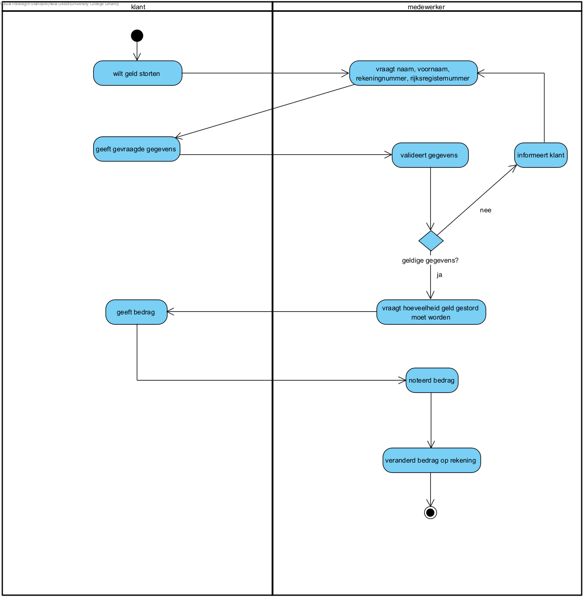

== *Geld storten*
=== *Activity Diagram*

=== *BUC_GS  - Geld storten*
De klant probeert geld te storten naar zijn rekening. Er moet nagegaan worden of dit mogelijk is en bedrag op zijn rekening veranderd worden.

==== Actors 
[underline]##Klant##, medewerker

==== Preconditie 
De klant is geïdentificeerd. De klant moet een rekening hebben bij de bank.

==== Basis pad 
. De [underline]#klant# wilt  geld storten
. De [underline]#medewerker# vraagt de nodige gegevens: naam, voornaam, rekeningnummer, rijksregisternummer
. De [underline]#klant# geeft de gevraagde gegevens
. De [underline]#medewerker# valideert de gegeven volgens link:DR_GS.adoc[DR_GS]
. De [underline]#medewerker# vraagt hoeveel geld gestort moet worden
. De [underline]#klant# geeft het bedrag
. De [underline]#medewerker# noteert het bedrag
. De [underline]#medewerker# verandert het bedrag op de rekening
. De use case eindigt

===== Postconditie 
*De  medeweker heeft het bedrag van de rekening verhoogd met de hoeveelheid die de klant gaf.*

==== Alternatief A : De klant gaf foutieve gegevens
[start=5]
. De [underline]#medewerker# informeert de klant
. Ga terug naar stap 2

=== *Scenario*
[%hardbreaks]
Activity: Geld storten 
Klant: Jan Janssens
Geboortedatum: 12-09-1975
Datum: 09-10-2023
[%hardbreaks]
Jan Janssen komt binnen in de bank.
Jan wilt geld storten.
De medewerker vraagt de nodige gegevens: naam, voornaam, rekeningnummer. 
Jan geeft de gevraagde gegevens.
De medewerker valideert de gegeven volgens link:DR_GS.adoc[DR_GS].
De medewerker vraagt hoeveel geld gestort worden.
Jan geeft het bedrag.
De medewerker noteert de bedrag.
De medewerker verandert de bedrag op de rekening.
De use case eindigt.