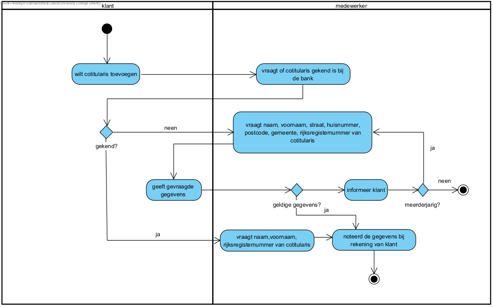

link:Groepstaak1.adoc[Ga terug naar het overzicht]

== *Co-Titularis Toevoegen*
=== *Activity Diagram*

=== *BUC_CTT  - Co-Titularis Toevoegen*
De klant wilt een co-titularis toevoegen aan zijn rekening.

==== Actors 
[underline]##**De klant**##, medewerker

==== Preconditie
/

==== Basis pad
. De klant wilt een cotitularis toevoegen aan zijn rekening
. De medewerker vraagt of de titularis gekend is bij de bank
. De medewerker vraagt de naam, voornaam, straat, huisnummer, postcode, gemeente en rijksregisternummer van de titularis
. De klant geeft de gegevens van de titularis
. De medewerker controleert de gegevens volgens DR_VRO
. De medewerker noteert de naam van de titularis bij de rekening van de klant
. De use case eindigt

==== Postconditie 
*De titularis is toegevoegd aan de rekening van de klant.*

==== Alternatief A : De titularis is nog niet gekend bij de bank
[start=3]
. De medewerker vraagt de naam, voornaam en het rijksregisternummer van de co-titularis
. Ga terug naar stap 6 in het gewone verloop

==== Exception A : De klant gaf niet de nodige gegevens volgens DR_VRO
[start=6]
. De medewerker informeert de klant
. De use case eindigt

=== *Scenario*

link:Groepstaak1.adoc[Ga terug naar het overzicht]