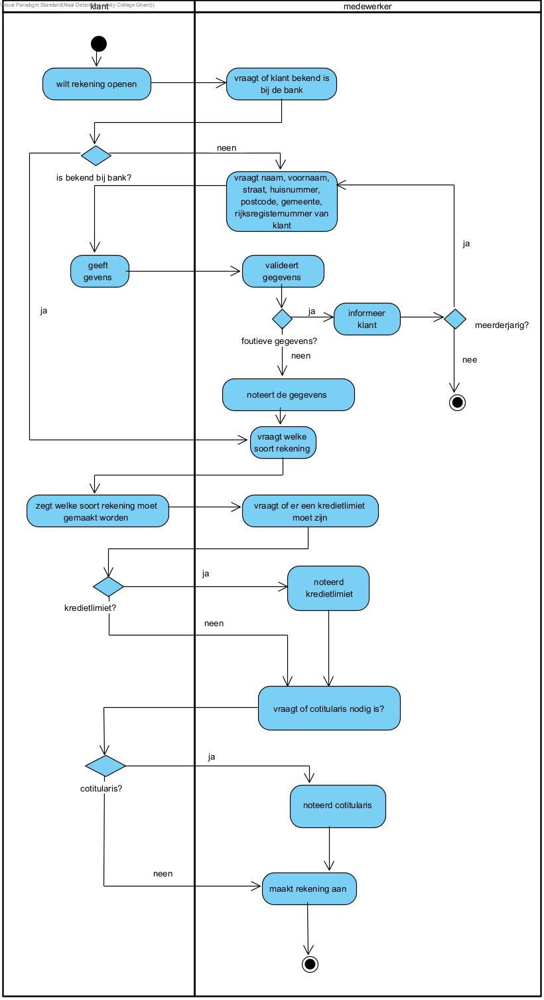

link:Groepstaak1.adoc[Ga terug naar het overzicht]

== *Rekening openen*
=== *Activity diagram*

=== *BUC_RO - Rekening openen*
De klant probeert een rekening te openen bij de bank. Er moet nagegaan worden of de klant al bekend is bij de bank en of de klant meerderjarig is.

==== Actors
[underline]##**Klant**##, medewerker

==== Preconditie
/

==== Basis pad
. De [underline]#klant# wilt een rekening openen
. De [underline]#medewerker# vraagt of de klant al een rekening heeft bij de bank
. De [underline]#medewerker# vraagt de nodige gegevens: naam, voornaam, straat, huisnummer, postcode, gemeente, rijksregisternummer
. De [underline]#klant# geeft de gevraagde gegevens
. De [underline]#medewerker# valideert de gegevens volgens link:DR.adoc[DR_VRO]
. De [underline]#medewerker# noteert de gegevens
. De [underline]#medewerker# vraagt welke soort rekening de klant wilt aanmaken 
. De [underline]#medewerker# vraagt of er een kredietlimiet moet staan op de rekening.
. De [underline]#medewerker# vraagt of er een cotitularis moet toegevoegd worden.
. De [underline]#medewerker# maakt de rekening aan
. De use case eindigt

==== Postconditie
*De rekening is aangemaakt.* 

==== Alternatief A : De klant is al gekend bij de bank
[start=3]
. De [underline]#medewerker# maakt de rekening aan
. Keer terug naar stap 7 in het normaal verloop

==== Alternatief B : De klant heeft foutieve gegevens doorgegeven volgens link:DR.adoc[DR_VRO]
[start=6]
. De [underline]#medewerker# informeert de klant over foutieve gegevens
. Keer terug naar stap 3 in het normaal verloop

==== Alternatief C : De klant wilt een kredietlimiet
[start=9]
. De [underline]#medewerker# vraagt hoe hoog de klant het limiet mag zijn
. Keer terug naar stap 10 in het normaal verloop

==== Alternatief D : De klant wilt een cotitularis
[start=10]
. De [underline]#medewerker# vraagt de gegevens van de cotitularis
. De [underline]#klant# geeft de gegevens van de cotitularis: naam, voornaam, straat, huisnummer, postcode, gemeente, rijksregisternummer
. De medewerker controleert de gegevens volgens link:DR.adoc[DR_GT]

==== Exception A : De klant voldoet niet aan de inschrijvingsvoorwaarden volgens link:DR.adoc[DR_VRO]
[start=6]
. De [underline]#medewerker# merkt dat de klant niet aan de inschrijvingsoorwaarden voldoet
. De [underline]#medewerker# meldt dit aan de klant
. De use case eindigt

=== *Scenario*
[%hardbreaks]
Rekening: Spaarrekening
Klant: Jan Janssens
Geboortedatum: 12-09-1975
Datum: 09-10-2023
[%hardbreaks]
Jan janssens komt binnen in de bank. 
De medewerker vraagt voor nodig gegevens.
Jan geeft de nodig gegevens.
De medeweker valideert de gegevens volgens link:DR.adoc[DR_VRO].
De medewerker houdt de gegevens bij.
Jan wilt een spaarrekening openen.
De mederweker maakt de spaarrekening.
De use case eindigt. 

link:Groepstaak1.adoc[Ga terug naar het overzicht]