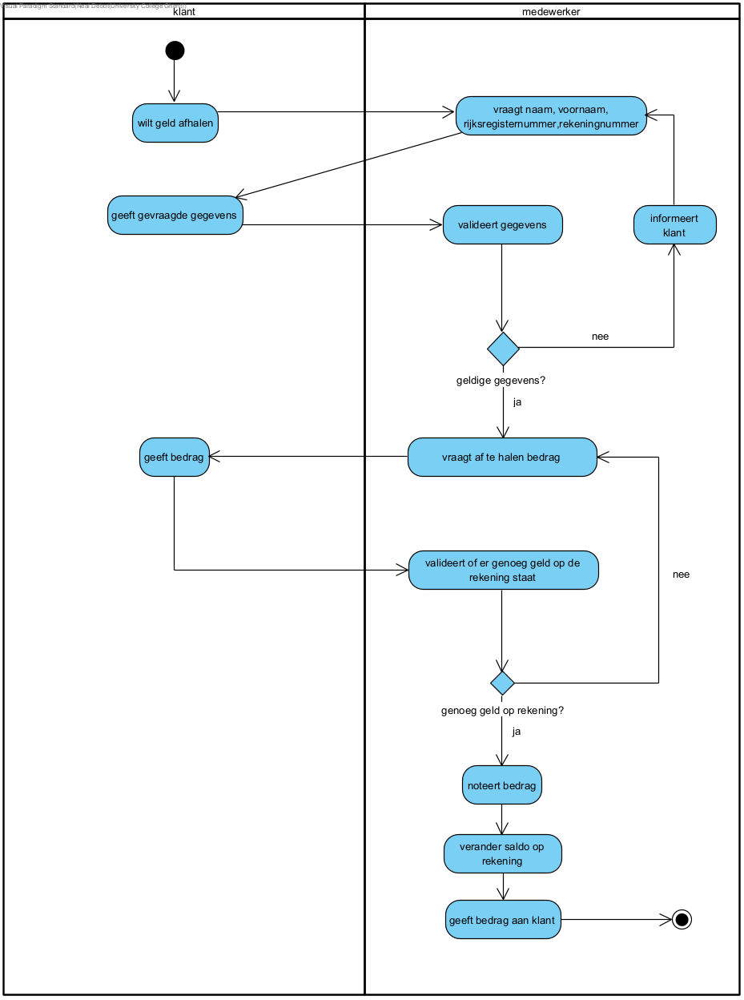

link:Groepstaak1.adoc[Ga terug naar het overzicht]

== *Geld afhalen*
=== *Activity Diagram*

=== *BUC_GA  - Geld afhalen*
De klant probeert geld af te halen van zijn rekening. Er moet nagegaan worden of dit mogelijk is en bedrag op zijn rekening veranderd worden.

==== Actors 
[underline]##**Klant**##, medewerker

==== Preconditie
[%hardbreaks]
De klant moet een rekening hebben bij de bank.

==== Basis pad 
. De [underline]#klant# wilt geld afhalen
. De [underline]#medewerker# vraagt de nodige gegevens: naam, voornaam, rekeningnummer en rijksregisternummer
. De [underline]#klant# geeft de gevraagde gegevens
. De [underline]#medewerker# valideert de gegeven volgens link:DR.adoc[DR_GA]
. De [underline]#medewerker# vraagt hoeveel geld de klant wilt afhalen en van welke rekening
. De [underline]#klant# zegt hoeveel hij wilt afhalen en van welke rekening
. De [underline]#medewerker# controleert of er voldoende geld op de rekening staat
. De [underline]#medewerker# geeft het geld en een bewijs van afhalen aan de klant
. De [underline]#medewerker# noteert het bedrag
. De [underline]#medewerker# verandert het bedrag op de rekening
. De use case eindigt

==== Postconditie 
*De rekening van de klant is met het aangegeven bedrag verlaagd.*

==== Alternatief A : De klant geeft foutieve gegevens.
[start=5]
. De [underline]#medewerker# informeert de klant
. Ga terug naar stap 2

==== Alternatief B : De klant heeft niet genoeg geld op zijn rekening staan
[start=8]
. De [underline]#medewerker# informeert de klant
. Ga terug naar stap 5

=== *Scenario*
[%hardbreaks]
Activity: Geld afhalen
Klant: Jan Janssens
Geboortedatum: 12-09-1975
Datum: 09-10-2023
[%hardbreaks]
Jan Janssen komt binnen in de bank.
Jan wilt 200 euro afhalen.
De medewerker vraagt de nodige gegevens : naam, voornaam, rekeningnummer en rijksregisternummer.
Jan geeft de gevraagde gegevens: Janssens, Jan, BE27 1431 0598 9172, 75.09.12-123.45.
De medewerker valideert de gegevens volgens link:DR.adoc[DR_GA].
De medewerker vraagt hoeveel geld de klant wil afhalen.
De medewerker controleert of er voldoende geld is op de rekening.
De medewerker geeft de 200 euro.
De medewerker verlaagt het bedrag op de rekening met 200 euro.
De use case eindigt.

link:Groepstaak1.adoc[Ga terug naar het overzicht]