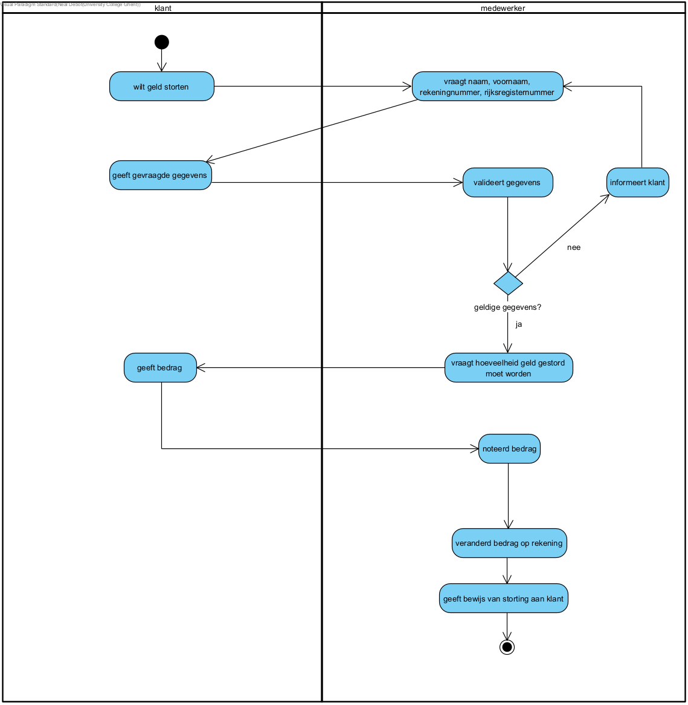

link:Groepstaak1.adoc[Ga terug naar het overzicht]

== *Geld storten*
=== *Activity Diagram*

=== *SUC_GS  - Geld storten*
De klant probeert geld te storten naar zijn rekening. Er moet nagegaan worden of dit mogelijk is en bedrag op zijn rekening veranderd worden.

==== Actors 
[underline]##**Klant**##

==== Preconditie
[%hardbreaks] 
De klant moet een rekening hebben bij de bank.

==== Basis pad 
. De [underline]#klant# wilt  geld storten
. Het [underline]#systeem# vraagt de nodige gegevens: naam, voornaam, rekeningnummer, rijksregisternummer
. De [underline]#klant# geeft de gevraagde gegevens
. Het [underline]#systeem# valideert de gegevens volgens link:DR.adoc[DR_GS]
. Het [underline]#systeem# vraagt hoeveel geld gestort moet worden en op welke rekening
. De [underline]#klant# geeft het bedrag en de rekening
. Het [underline]#systeem# noteert het bedrag
. Het [underline]#systeem# verandert het bedrag op de rekening
. Het [underline]#systeem# geeft de klant een bewijs van storting
. De use case eindigt

===== Postconditie 
*De rekening van de klant is met het aangegeven bedrag verhoogd.*

==== Alternatief A : De klant gaf foutieve gegevens
[start=5]
. Het [underline]#systeem# informeert de klant
. Ga terug naar stap 2

=== *Scenario*
[%hardbreaks]
Activity: Geld storten 
Klant: Jan Janssens
Geboortedatum: 12-09-1975
Datum: 09-10-2023
[%hardbreaks]
Jan Janssen komt binnen in de bank.
Jan wilt 200 euro storten.
De medewerker vraagt de nodige gegevens: naam, voornaam, rekeningnummer. andert
Jan geeft de gevraagde gegevens: Janssens, Jan, BE27 1431 0598 9172.
De medewerker valideert de gegeven volgens link:DR.adoc[DR_GS].
De medewerker vraagt hoeveel geld gestort worden.
Jan geeft 200 euro.
De medewerker noteert het bedrag.
De medewerker verhoogt het bedrag op de rekening met 200 euro.
De use case eindigt.

link:Groepstaak1.adoc[Ga terug naar het overzicht]