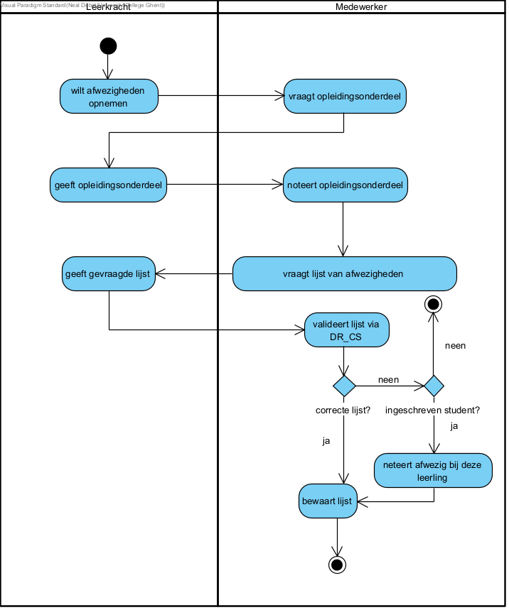

link:Groeptaak2.adoc[Ga terug naar het overzicht]

== *Afwezigheden opnemen*
=== *Activity Diagram*

=== *BUC_AO  - Afwezigheden opnemen*
De leerkracht wilt afwezigheden opnemen

==== Actors 
[underline]##**leerkracht**##, studenten

==== Preconditie
/

==== Basis pad
. De [underline]#leerkracht# wilt de afwezigheden opnemen voor een bepaald vak
. De [underline]#leerkracht# neemt er de lijst met studenten bij die zijn ingeschreven voor het vak
. De [underline]#leerkracht# vraagt aan de klas of de eerstvolgende naam op zijn lijst aanwezig is
. De [underline]#student# in kwestie reageert dat hij/zij aanwezig is
. De [underline]#leerkracht# noteert dat de student aanwezig is
. Stap 3 tot en met stap 5 worden herhaal voor elke student ingeschreven voor dit vak
. De use case eindigt

==== Postconditie 
*De administratie bevat een aanwezigheidsstatus voor een student voor een bepaald vak*

==== Alternatief A : de student is afwezig
[start=4]
. De [underline]#leerkracht# noteert dat de student afwezig is
. Ga terug naar stap 6 in het normale verloop

=== *Scenario*
[%hardbreaks]
Activity: Afwezigheid opnemen
Leerkracht: Jan Janssens
Geboortedatum: 12-09-1985
Datum: 20-10-2023
[%hardbreaks]

link:Groeptaak2.adoc[Ga terug naar het overzicht]