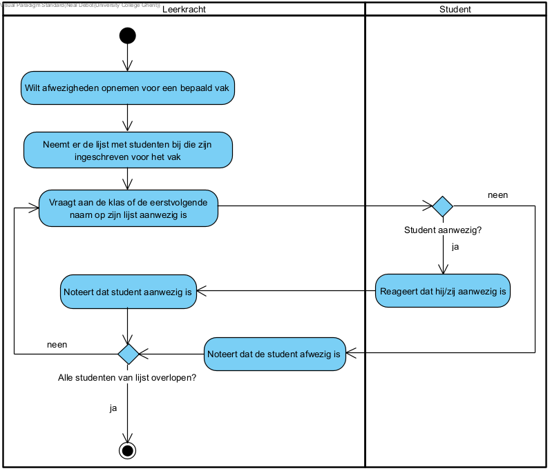

== *Afwezigheden opnemen*
=== *Activity Diagram*

=== *BUC_AO  - Afwezigheden opnemen*
De leerkracht wilt afwezigheden opnemen

==== Actors 
[underline]##**Leerkracht**##, medewerker

==== Preconditie
/

==== Basis pad
. De [underline]#leerkracht# wilt de afwezigheden opnemen
. De [underline]#medewerker# vraagt voor welke opleiding de afwezigheden zijn
. De [underline]#leerkracht# zegt over welk opleidingsonderdeel het gaat
. De [underline]#medewerker# noteert de opleiding
. De [underline]#medewerker# vraagt de lijst van aan-/afwezigheden
. De [underline]#leerkracht# geeft de gevraagde lijst
. De [underline]#medewerker# valideert de lijst met aan-/afwezigheden volgens link:DR.adoc[DR_CS]
. De [underline]#medewerker# bewaart de lijst
. De use case eindigt

==== Postconditie 
*De aanwezigheden van het opleidingsonderdeel zijn opgenomen*

==== Alternatief A : 1 of meerdere leerlingen staan niet op de aan-/afwezigheidslijst
[start=8]
. De [underline]#medewerker# noteert afwezig bij deze leerling
. Ga terug naar stap 8 in het normale verloop

==== Exception A : 1 of meerdere leerlingen staan op de aan-/afwezigheidslijst maar staan niet in de opleiding ingeschreven
[start=8]
. De [underline]#medewerker# geeft deze info aan de leerkracht 
. De use case eindigt

=== *Scenario*
[%hardbreaks]
Activity: Afwezigheid opnemen
Leerkracht: Jan Janssens
Geboortedatum: 12-10-2000
Datum: 15-09-2023
[%hardbreaks]
Jan Janssens controleert de aanwezigheden in de klas en merkt dat Peter Peeters niet aanwezig is.
Jan wilt de afwezigheid opnemen.
De medewerker vraagt voor welke opleiding de afwezigheid is.
Jan zegt dat het voor Programmeren is.
De medewerker vraagt wie de afwezigen zijn
Jan zegt dat alleen Peter afwezig is.
De medewerker valideert de lijst volgens link:DR.adoc[DR_CS] en bewaart de afwezigheid van Peter.
De use case eindigt.