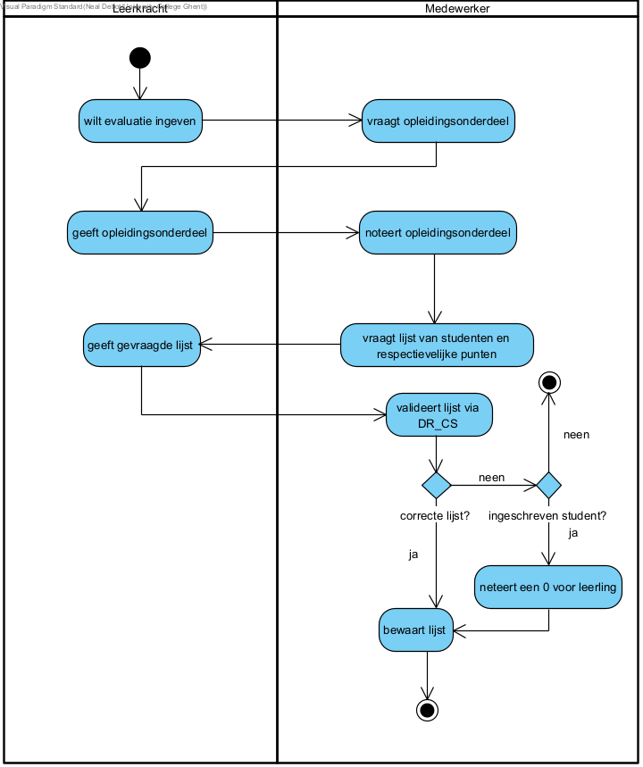

== *Evaluatie ingeven*
=== *Activity Diagram*

=== *BUC_EI  - Evaluatie ingeven*
De leerkracht wilt een evaluatie ingeven.

==== Actors 
[underline]##**Leerkracht**##, medewerker

==== Preconditie
/

==== Basis pad
. De [underline]#leerkracht# wilt een evaluatie ingeven
. De [underline]#medewerker# vraagt voor welk opleidingsonderdeel de punten zijn
. De [underline]#leerkracht# zegt over welk opleidingsonderdeel het gaat
. De [underline]#medewerker# noteert het opleidingsonderdeel
. De [underline]#medewerker# vraagt een lijst van de studenten en respectievelijke punten
. De [underline]#leerkracht# geeft de gevraagde lijst
. De [underline]#medewerker# valideert de lijst met punten volgens link:DR.adoc[DR_CS]
. De [underline]#medewerker# bewaart de lijst
. De use case eindigt

==== Postconditie 
*De evaluatie voor de opleiding is toegevoegd*

==== Alternatief A : 1 of meerdere leerlingen staan niet op de evaluatielijst
[start=8]
. De [underline]#medewerker# noteert een 0 als punt bij deze leerling
. Ga terug naar stap 8 in het normale verloop

==== Exception A : 1 of meerdere leerlingen staan op de evaluatielijst maar staan niet in de opleiding ingeschreven
[start=8]
. De [underline]#medewerker# geeft deze info aan de leerkracht 
. De use case eindigt

=== *Scenario*
[%hardbreaks]
Activity: Evaluatie ingeven
Leerkracht: Jan Janssens 
Geboortedatum: 12-09-1985
Datum: 20-10-2023
[%hardbreaks]
Jan Janssens  wilt de evaluatie van 1ste semester ingeven. 
De medewerker vraagt voor welk opleidingsonderdeel de punten zijn.
Jan geeft de informatie over het opleidingsonderdeel.
De medewerker noteert het opleidingsonderdeel.
De medeweker vraagt een lijst van de studenten en respectievelijke punten.
Jan geeft de gevraagde lijst.
De medewerker valideert de lijst met punten volgens link:DR.adoc[DR_CS].
De medewerker bewaart de lijst.
De use case eindigt.