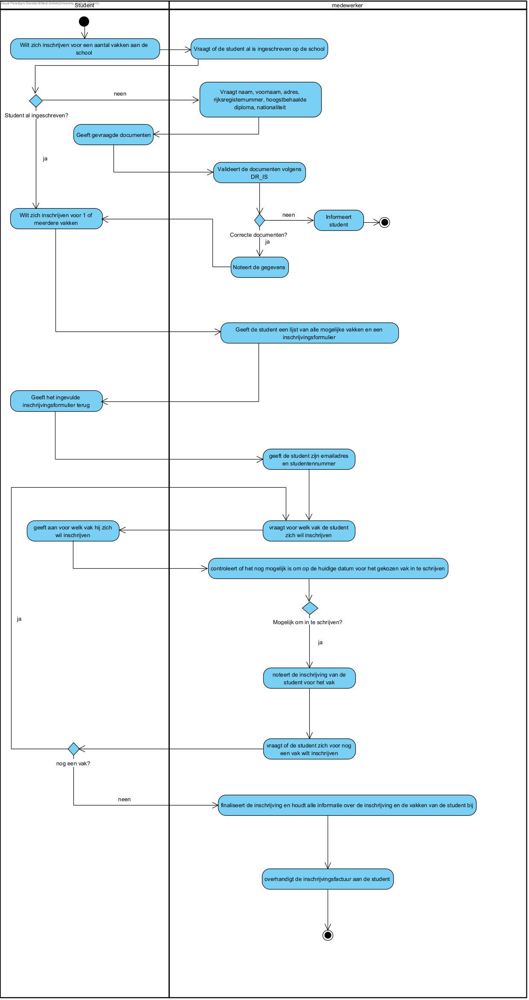

== *Persoon Inschrijven*

=== *Activity Diagram*

=== *BUC_PI - Persoon Inschrijven*
Student wilt zich inschrijven aan de school. Alle nodige gegevens moeten opgenomen worden en de persoon moet in het systeem gezet worden.

==== Actors 
[underline]##**Student**##, medewerker

==== Preconditie 
/

==== Basis pad 
. De [underline]#student# wilt zich inschrijven aan de hogeschool
. De [underline]#medewerker# vraagt de nodige gegevens: naam, voornaam, adres, rijksregisternummer, hoogstbehaalde diploma, nationaliteit
. De [underline]#student# geeft de gevraagde gegevens
. De [underline]#medewerker# valideert de gegevens volgens link:DR.adoc[DR_IS]
. De [underline]#medewerker# noteert de gegevens
. De [underline]#medewerker# vraagt voor welke opleiding de student zich wil inschrijven
. De [underline]#student# geeft de gekozen opleiding
. De [underline]#medewerker# finaliseert de inschrijving en houdt alle informatie bij
. De use case eindigt

==== Postconditie 
**De student is ingeschreven voor de gekozen opleiding aan de school.**

==== Alternatief A : De gegevens kloppen niet volgens link:DR.adoc[DR_IS]
[start=5]
. De [underline]#medewerker# meldt dit aan de student
. Ga terug naar stap 2 in het normale verloop

==== Exception A : De student wilt zich inschrijven voor een opleiding die de school niet aanbiedt
[start=8]
. De [underline]#medewerker# meldt dit aan de student en raadt de student aan om een andere school te zoeken
. De use case eindigt

=== *Scenario*
[%hardbreaks]
Activity: Persoon inschrijven
Klant: Jan Janssens
Geboortedatum: 12-10-2000
Datum: 15-09-2023
[%hardbreaks]
Jan Janssens komt binnen in het bureau van de studentenadministratie.
Jan wilt zich inschrijven voor het Graduaat Programmeren.
De medewerker vraagt de nodige gegevens van Jan: naam, voornaam, adres, rijksregisternummer, hoogstbehaalde diploma, nationaliteit.
Jan geeft de nodige gegevens: Janssens, Jan, Vlaanderenstraat 50 - 9000 Gent, 00.10.12-123.45, Secundair Diploma ASO Handelswetenschappen, Belg.
De medewerker valideert de gegevens volgens link:DR.adoc[DR_IS].
De medewerker noteert de gegevens.
De medewerker vraagt voor welke opleiding Jan zich wilt inschrijven.
Jan zegt dat hij zich wilt inschrijven voor het Graduaat Programmeren.
De medewerker finaliseert de inschrijving en houdt alle informatie bij.
De use case eindigt.