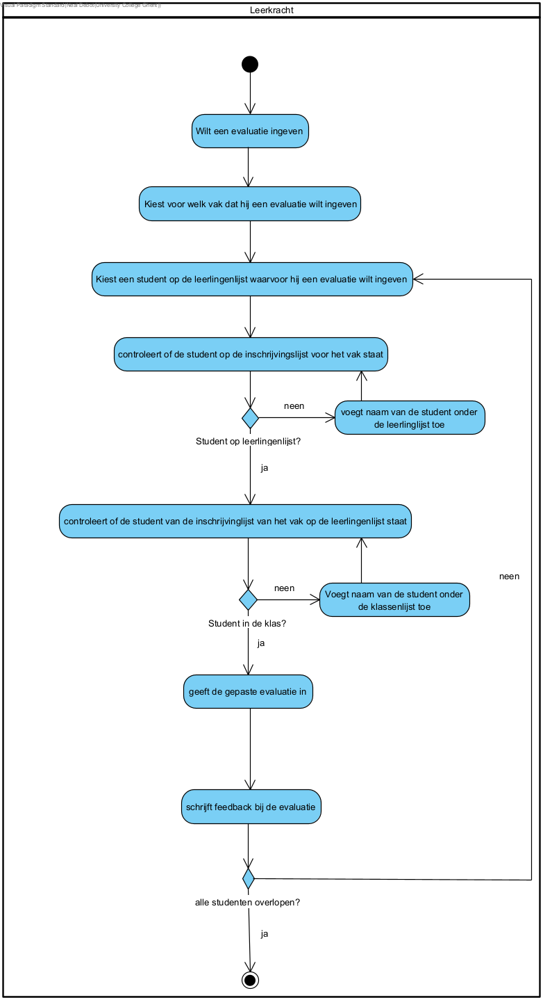

link:Groeptaak2.adoc[Ga terug naar het overzicht]

== *Evaluatie ingeven*
=== *Activity Diagram*

=== *BUC_EI  - Evaluatie ingeven*

==== Actors 
[underline]##**Leerkracht**##

==== Preconditie
De leerkracht is in bezit van een leerlingenlijst om op basis daarvan evaluaties in te geven.

==== Basis pad
. De [.underline]#leerkracht# wilt een evaluatie ingeven
. De [.underline]#leerkracht# kiest voor welk vak dat hij een evaluatie wilt ingeven
. De [.underline]#leerkracht# kiest een student op de leerlingenlijst waarvoor hij een evaluatie wilt ingeven
. De [.underline]#leerkracht# controleert of de student op de inschrijvingslijst voor het vak staat
. De [.underline]#leerkracht# controleert of de student van de inschrijvinglijst van het vak op de leerlingenlijst staat
. De [.underline]#leerkracht# geeft de gepaste evaluatie in
. De [.underline]#leerkracht# schrijft feedback bij de evaluatie
. Stap 3 tot en met stap 5 worden herhaald voor elke student ingeschreven voor dit vak
. De use case eindigt

==== Postconditie 
*De administratie bevat een score voor een student voor een bepaald vak*

==== Alternatief A : student staat niet op de leerlingenlijst
[start=4] 
. De [.underline]#docent# merkt dat de student niet op de leerlingenlijst staat
. De [.underline]#docent# voegt de naam van de student onder de leerlingenlijst toe
. Ga terug naar stap 4 van het normale verloop

==== Alternatief B : student staat op de leerlingenlijst maar zit niet in de klas
[start=5] 
. De [.underline]#docent# merkt dat de student niet in de klas zit
. De [.underline]#docent# voegt de naam van de student onder de klassenlijst toe
. Ga terug naar stap 5 van het normale verloop

=== *Scenario*
[%hardbreaks]
Activity: Evaluatie ingeven
Leerkracht: Jan Janssens 
Geboortedatum: 12-09-1985
Datum: 20-01-2024
[%hardbreaks]
Leerkracht Jan Janssens wilt de evaluatie van het eerste semester ingeven.
Jan kiest het vak Analyse om de evaluatie in te geven.
Jan kiest de eerste student op de leerlingenlijst (Adam Smith) om een evaluatie in te geven.
Jan controleert of Adam op de inschrijvingslijst voor het vak Analyse staat.
Jan geeft de evaluatiescore in.
Jan schrijft persoonlijke feedback bij de evaluatie.
Jan herhaalt dit voor elke student ingeschreven voor dit vak.
De use case eindigt.

link:Groeptaak2.adoc[Ga terug naar het overzicht]