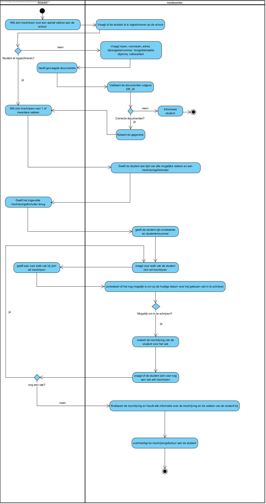

link:Groeptaak2.adoc[Ga terug naar het overzicht]

== *Persoon Inschrijven*

=== *Activity Diagram*

=== *BUC_PI - Persoon Inschrijven*
Student wilt zich inschrijven voor een aantal vakken aan de school. Alle nodige gegevens moeten opgenomen worden en de persoon moet in het systeem gezet worden.

==== Actors 
[underline]##**Student**##, medewerker

==== Preconditie 
/

==== Basis pad 
. De [underline]#student# wilt zich inschrijven voor een aantal vakken aan de school
. De [underline]#medewerker# vraagt of de student al is ingeschreven op de school
. De [underline]#student# wilt zich inschrijven voor 1 of meerdere vakken
. De [underline]#medewerker# geeft de student een lijst van alle mogelijke vakken en een inschrijvingsformulier
. De [underline]#student# geeft het ingevulde inschrijvingsformulier terug
. De [underline]#medewerker# geeft de student zijn emailadres en studentennummer
. De [underline]#medewerker# vraagt voor welk vak de student zich wil inschrijven
. De [underline]#student# geeft aan voor welk vak hij zich wil inschrijven
. De [underline]#medewerker# controleert of het nog mogelijk is om op de huidige datum voor het gekozen vak in te schrijven
. De [underline]#medewerker# noteert de inschrijving van de student voor het vak
. De [underline]#medewerker# vraagt of de student zich voor nog een vak wilt inschrijven
. Stap 7 tot en met stap 11 worden herhaald zolang de student zich voor extra vakken wilt inschrijven
. De [underline]#medewerker# finaliseert de inschrijving en houdt alle informatie  over de inschrijving en de vakken van de student bij
. De [underline]#medewerker# overhandigt de inschrijvingsfactuur aan de student
. De use case eindigt

==== Postconditie 
**De administratie bevat een inschrijving voor de student voor de gekozen vakken.**

==== Alternatief A : de student is nog niet ingeschreven op de school
[start=3]
. De [underline]#medewerker# vraagt de nodige gegevens: naam, voornaam, adres, rijksregisternummer, hoogstbehaalde diploma, nationaliteit
. De [underline]#student# geeft de gevraagde documenten
. De [underline]#medewerker# valideert de documenten volgens link:DR.adoc[DR_IS]
. De [underline]#medewerker# noteert de gegevens
. Ga terug naar stap 3 van het normale verloop

==== Alternatief B : de student koos een vak waarvoor de inschrijvingstermijn is verlopen
[start=10]
. De [underline]#medewerker# geeft hiervan melding aan de student
. Ga terug naar stap 11 van het normale verloop

==== Exception A : de student voldoet bij inschrijving niet aan de voorwaarden volgens link:DR.adoc[DR_IS]
[start=6]
. De [underline]#medewerker# geeft hiervan melding aan de student
. De use case eindigt

=== *Scenario*
[%hardbreaks]
Activity: Persoon inschrijven
Student: Jan Janssens
Geboortedatum: 12-10-2000
Datum: 15-09-2023
[%hardbreaks]
Jan Janssens wilt zich inschrijven voor aantal vakken van de opleiding Graduaat Programmeren aan de HOGENT.
De medewerker vraagt of hij al een is student bij HOGENT.
Jan reageert neen.
De medewerker geeft hem een lijst van alle mogelijke vakken en een inschrijvingsformulier.
Jan vult het inschrijvingsformulier in geeft het terug aan de medewerker.
De medewerker geeft hem zijn nieuwe HOGENT emailadres en zijn studentennummer.
De medewerker vraagt voor welk vakken Jan zich wil inschrijven.
Jan zegt dat hij zich wilt inschrijven voor het vak Analyse. 
De medewerker controleert of het nog mogelijk is om op de huidige datum voor het gekozen vak in te schrijven.
De medewerker noteert de inschrijving van Jan Jannsens voor het vak Analyse.
De medewerker vraagt of de student zich voor nog een vak wilt inschrijven.
Jan reageert ja en zegt de vakken Web1 en Programmeren: Basis.
Medewerker herhaalt de stappen voor de andere twee vakken. 
De medewerker finaliseert de inschrijving en houdt alle informatie over de inschrijving en de vakken van Jan Janssens bij.
De medewerker overhandigt de inschrijvingsfactuur aan Jan Janssens.
De use case eindigt.

link:Groeptaak2.adoc[Ga terug naar het overzicht]